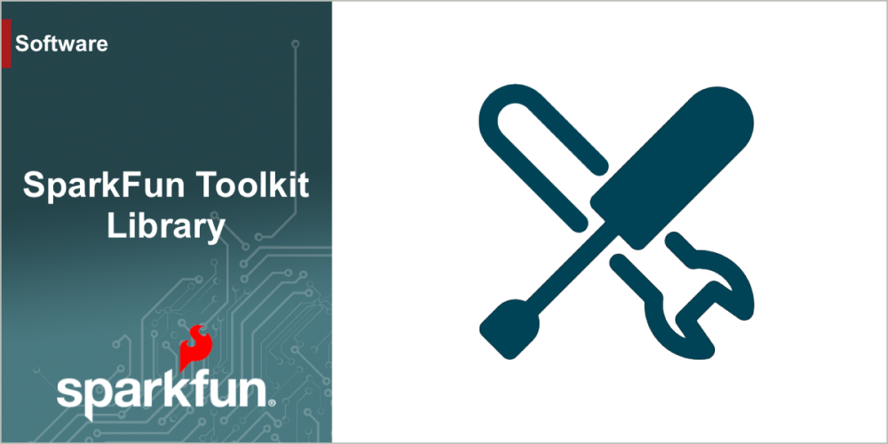

# SparkFun Toolkit Arduino Library


The SparkFun Toolkit provides a common set of core functionality for use across the SparkFun Arduino Driver library. Instead of each device driver library implementing it's own communication layers, error types and design, the SparkFun Toolkit library is used.

## Motivation

Often, the same core functionality is implemented with a majority of our Arduino libraries, each implementation providing the same functionality, but implemented differently. The result is solutions that have different quirks, and impossible to maintain/support effectively. The SparkFun Toolkit solves this issue.

The SparkFun Toolkit provides a single implementation of common functionality used in the software developed for SparkFun boards. Initially targeted  at the Arduino development environment, the SparkFun Toolkit delivers the following benefits:

* Use a well-tested and validated implementation
* Reduce development effort
* Implement functionality following a common structure
* Set the foundation for future enhancements - as the capabilities of the toolkit grow, these features become available with little to any implementation effort.

## Documentation

The SparkFun Toolkit Development documentation is available [here](https://docs.sparkfun.com/SparkFun_Toolkit)

## Installation and Use

To use the SparkFun Toolkit directly, or in library development kit is installable via the Arduino Library Manager - search for `SparkFun ToolKit` within the Arduino Library Manager to install.

However, for solutions that use the SparkFun Toolkit, it is installed automatically during the Arduino library installation process, by marking the Toolkit as a dependency when publishing your library.

To mark the `SparkFun Toolkit` as a dependency, add the following line to the `library.properties` file for your library.

```INI
depends=SparkFun Toolkit
```

## Examples

The following Arduino Libraries are making use of the SparkFun Toolkit:

* [SparkFun Qwiic Pulsed Coherent Radar Sensor XM125](https://github.com/sparkfun/SparkFun_Qwiic_XM125_Arduino_Library)
* [SparkFun Qwiic AS7331 Spectral UV Sensor](https://github.com/sparkfun/SparkFun_AS7331_Arduino_Library)
