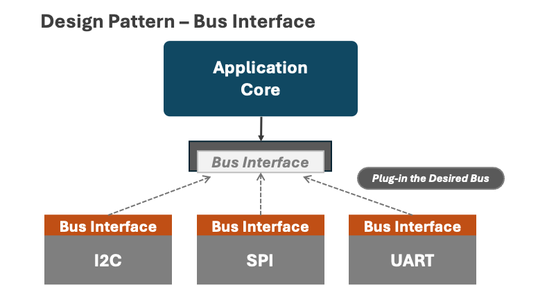
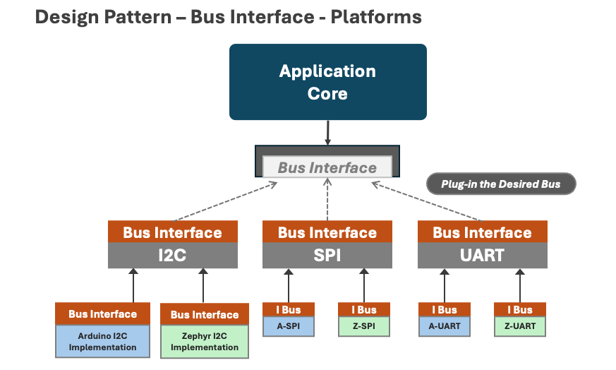

# Device Bus Interface - Overview

One of the foundational capabilities of the SparkFun Toolkit is bus communication with devices. This is a common task almost all libraries implement using their own implementation for I2C, SPI or UART bus communication.

For bus communication, the SparkFun Toolkit is designed to provide a common implementation for use across all SparkFun libraries. Additionally, the bus architecture is modeled on a *driver* pattern, separating  the individual bus setup/configuration from data communication, enabling a single device implementation to easily support a variety of device bus types.

## The Bus Interface Design Pattern

This pattern allows an application to develop against the common bus interface without regard to the underlying bus type or implementation. This *plug-in* nature of this model enables core application reuse across a range of bus devices. What to use a different bus type? Just use a different driver.

This pattern is show in the following diagram:



This pattern extends across different platforms, allowing a common platform independent application core to utilize platform specific bus drivers.



The platform dependant drivers implement the core Bus Interface (IBus) for communication, with platform specific setup and management left to the underlying implementation. Since the application core only works with the Bus Interface, if implemented correctly, the same core works across different bus types and across different development environments.

## Goals

For the initial implementation the key goals set for the Bus implementation in the Toolkit include:

* Separate device setup from device communication
* Define a common bus interface for use across a variety of common device bus types
* Deliver support for both SPI and I2C bus types initially, focusing on Arduino
* Structure the bus/toolkit implementation such that it's platform independent

## Architecture Overview

As outlined above, the SparkFun Toolkit follows a ***Driver Pattern***, defining a common interface for bus communication. Device drivers are designed around this interface, leaving bus configuration and implementation to platform specific implementation.

The key class to support this pattern are:

| | |
|------|-------|
|**sfeTkIBus** | A virtual C++ class that device the bus ```sfeTkIBus``` interface |
|**sfeTkII2C** | Sub-class of the ```sfeTkIIBus``` interface, it provides an interface for I2C devices|
|**sfeTkISPI** | Sub-class of the ```sfeTkIIBus``` interface, it provides an interface for SPI devices |

### The sfeTkIBus Interface

The key to meeting the goals of the Toolkit is the IBus interface. This interface defines the  methods used to communicate with a device. The setup, configuration and implementation of this interface is performed by platform specific implementations of the interface.

The interface methods:

| Method| Definition |
|------|-------|
|**writeRegisterByte** | Write a byte of data to a particular register of a device |
|**writeRegisterWord** | Write a word of data to a particular register of a device |
|**writeRegisterRegion** | Write an array of data to a particular register of a device|
|**readRegisterByte** | Read a byte of data from a particular register of a device |
|**readRegisterWord** | Read a word of data from a particular register of a device |
|**readRegisterRegion** | Read an array of data from a particular register of a device |

> [!NOTE]
> This interface only defines the methods to read and write data on the given bus. Any address, or bus specific settings is provided/implemented by the implementation/specialization of this interface.

The Inteface diagram for the ```sfeTkIBus``` is:


### The sfeTkII2C Implementation

This class sub-classes from the ```sfeTkIBus``` interface adding additional functionally focused on supporting an I2C implementation. This class does not implement the IIBus interface, so it's abstract, but the class adds the additional functionality.

| Method| Definition |
|------|-------|
|**ping** | Determine if a devices is connected to the I2C device at the address set on this bus object. This is an interface method |
|**setAddress** | Set the I2C address to use for this I2C object |
|**address** | Returns the address used by this I2C object |

> [!NOTE]
> The ```sfeTkII2C``` class manages the device address for the I2C bus. As such, each I2C device instantiates/uses an instance of the ```sfeTkII2C``` class.

The class diagram for the ```sfeTkII2C``` interface is the following:


### The sfeTkISPI Implementation

This class sub-classes from the ```sfeTkIBus``` interface adding additional functionally focused on supporting an SPI implementation. This interface provides the additional functionality.

| Method| Definition |
|------|-------|
|**setCS** | Set the CS Pin to use for this SPI object |
|**cs** | Returns the CS Pin used by this SPI object |

> [!NOTE]
> The ```sfeTkISPI``` class manages CS Pin for the SPI bus. As such, each SPI device instantiates/uses an instance of the ```sfeTkISPI``` class.

The class diagram of these base class interfaces/implementation:


## sfeTkIBus - Arduino Implementation

The initial implementation of the toolkit IBus interface is for the Arduino environment. This implementation consists of two classes, ```sfeTkArdI2C``` and ```sfeTkArdSPI```, each of which sub-class from their respective bus type interfaces within the core toolkit.

These driver implementations provide the platform specific implementation for the toolkit bus interfaces, supporting the methods defined by the interfaces, as well as contain and manage the platform specific settings and attributes for each bus type.

> [!IMPORTANT]
> The intent is that each user of an particular - a device in most cases - contains an instance of the specific bus class.

### The sfeTkArdI2C Class

This class provides the Arduino implementation of I2C in the SparkFun Toolkit. It implements the methods of the ```sfeTkIBus``` and ```sfeTkII2C``` interfaces, as well as manages any Arduino specific state.

The class diagram for the sfeTkArdI2C class:


### The sfeTkArdSPI Class

This class provides the Arduino implementation of SPI in the SparkFun Toolkit. It implements the methods of the ```sfeTkIBus``` and ```sfeTkISPI``` interfaces, as well as manages any Arduino specific state for the SPI bus - namely the SPISettings class.

Before each use of the SPI bus, the methods of the ```sfeTkArdSPI``` uses an internal SPISettings class to ensure the SPI bus is operating in the desired mode for the device.

The class diagram for the sfeTkArdSPI class:


## sfeTkIBus Use

The general steps when using the sfeTkIBus in device development are outlined in the following steps. This example uses the Arduino implementation of the bus.

The general pattern for a device driver implementation that uses the SparkFun Toolkit is the following:

### Implement a Platform Independent Driver

The first step is to implement a core, platform independent version of the driver that communicates to the target device using the methods of a ```sfeTkIBus``` interface. By limiting use to the IBus interface, the core implementation can use any bus type or platform that implements the sfeTkIBus interface.

>[!IMPORTANT]
> At this level, the driver is only using a ```sfeTkIBus``` interface, not any specific bus implementation.

This driver has the following unique functionality:

1) A method to set the object that implements the ```sfeTkIBus``` interface object should use. Since
1) If the device supports identification capabilities, the driver provides this functionality.

#### Simple Example of an Independent Driver Implementation

>[!NOTE]
> This code is **pseudo-code**, used to demonstrate the key concepts of the implementation pattern.

This implementation would take the following form:

```c++

class myDriverClass
{
public:

    myDriverClass(uint8_t address) : _addr{address}, _theBus{nullptr}{}

    bool begin()
    {
        // initialize things ...

        return true;
    }
    void setCommunicationBus(sfeTkIBus *theBus)
    {
        _theBus = theBus;
    }

    bool updateDeviceData(uint8_t *data, size_t len)
    {
        if (!_theBus || !data || len == 0)
            return false;

        sfeTkError_t status = _theBus->writeRegisterRegion(THE_REG, data, len);

        return (status == kSTkErrOk);
    }

    bool checkDeviceID()
    {
        // do some device ID checks in registers ...etc
        return true;
    }
private:
    uint8_t _addr;
    sfeTkIBus *_theBus;
};
```

### Write a Platform Specific Driver, based on the core driver

This driver sub-classes from the general/core driver class, builds and configures the desired bus object and passes this into the core driver.

The key concepts for these Platform specific drivers include:

1) Perform any platform specific bus setup during the instantiation of the device. This might just be setting the target (pin, address) for the device on the bus.
1) Implement any bus specific device identification use at this level. For example, on I2C, a ping call might be made on the bus before a more detailed identification method is used.

#### Basic concept - creating an I2C class in Arduino

The following is an example of an I2C class in Arduino based on the previous platform independent driver.

> [!NOTE]
> This class implements a ```isConnected()``` method that calls the ```ping()``` method of the I2C bus class being used, and if this passes, then calls the ```checkDeviceID()``` method of the superclass.

> [!NOTE]
> If your device supports repeated starts, make sure to include ```_theI2CBus.setStop(false)``` in your begin function. Otherwise this can cause issues with your device.

```c++

class myArduinoDriverI2C : public myDriverClass
{
  public:
    myArduinoDriverI2C()
    {}
   
    bool begin()
    {
        if (_theI2CBus.init(MY_DEVICE_ADDRESS) != kSTkErrOk)
            return false;

        // OPTIONAL: If your device supports repeat starts.
        _theI2CBus.setStop(false);

        setCommunicationBus(&_theI2CBus);

        return myDriverClass::begin();
    }

    bool isConnected()
    {
        if (_theI2CBus.ping() != kSTkErrOk)
            return false;

        return checkDeviceID();
    }

private:
   sfeTkArdI2C _theI2CBus;
};
```

#### Basic concept - creating an SPI class in Arduino

The following is a SPI version of the driver implemented in Arduino. While similar to the I2C implementation, it focuses on the specific needs of the SPI bus, specifically the ```SPISettings``` this particular device requires when using the SPI bus.

> [!NOTE]
> This class implements a ```isConnected()``` method that just calls the superclasses  ```checkDeviceID()``` method to determine if the device is available on the bus.

```c++

class myArduinoDriveSPI : public myDriverClass
{
  public:
    myArduinoDriverSPI()
    {}

    bool begin()
    {
        SPISettings spiSettings = SPISettings(4000000, MSBFIRST, SPI_MODE3);

        if (_theSPIBus.init(SPI, spiSettings, MY_DEFAULT_CS, true) != kSTkErrOk)
            return false;
        setCommunicationBus(&_theSPIBus);

        return myDriverClass::begin();
    }

    bool isConnected()
    {
        return checkDeviceID();
    }

private:
   sfeTkArdSPI _theSPIBus;
};
```

## Summary

In summary, the SparkFun Toolkit Bus Interface sets a standard that device drivers can implement against without concern for platform or bus type. Using common interface implementation patterns, the implementation delivers on the goals for this subsystem - namely:

* Separate device setup from device communication
* Define a common bus interface for use across a variety of common device bus types
* Deliver support for both SPI and I2C bus types initially, focusing on Arduino
* Structure the bus/toolkit implementation such that it's platform independent
